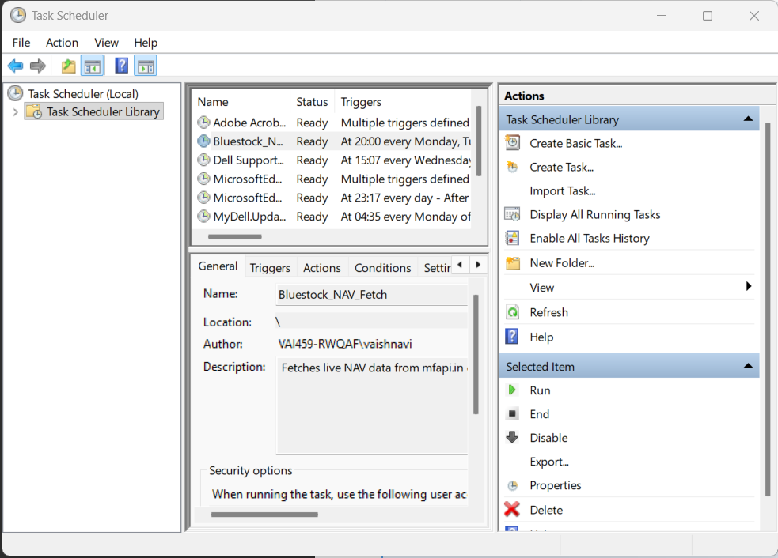

# B1 - Scheduled ETL (Windows Task Scheduler)

## Objective
Automatically fetch live NAV data from mfapi.in every weekday at 8:00 PM 
using Windows Task Scheduler (Windows equivalent of cron).

## Setup Details
- **Task Name:** Bluestock_NAV_Fetch
- **Trigger:** Weekly — Monday to Friday at 8:00 PM
- **Action:** Runs `python live_nav_fetch.py` 
- **Working Directory:** `scripts/`
- **Python Environment:** Project virtual environment (venv)

## Steps Followed
1. Opened Task Scheduler → Create Task
2. Set trigger: Weekly, Mon-Fri, 8:00 PM
3. Set action: Run venv python.exe with argument `live_nav_fetch.py`
4. Configured to run only when user is logged on
5. Verified task appears in Task Scheduler Library

## Screenshot

## Outcome
The script `live_nav_fetch.py` will run automatically every weekday at 
8 PM, fetching the latest NAV for HDFC Top 100 Direct and appending it 
to the raw CSV file — ensuring the dataset stays up to date with minimal 
manual intervention.
